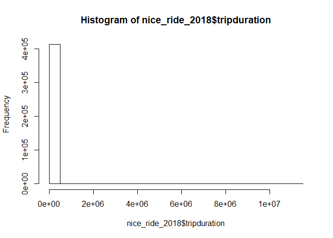

<!-- README.md is generated from README.Rmd. Please edit that file -->
metcouncilR
===========

<!-- badges: start -->
<!-- badges: end -->
The goal of metcouncilR is to make the data part easier during the Intro to R workshop. Eat your cake first!

Installation
------------

You can install the released version of metcouncilR from [GitHub](https://github.com/) with:

``` r
#install.packages("devtools")
devtools::install_github("katiejolly/metcouncilR")
```

Example
-------

This is a basic example which shows you how to plot the customer types in a bar plot.

``` r
library(metcouncilR)

data("nice_ride_2018")

# make a histogram of trip durations

barplot(table(nice_ride_2018$usertype), main="User Types in the MN Niceride System", xlab="")
```



``` r
summary(nice_ride_2018)
#>   tripduration      start_datetime               
#>  Min.   :      61   Min.   :2018-04-12 08:49:49  
#>  1st Qu.:     434   1st Qu.:2018-06-08 15:49:25  
#>  Median :     808   Median :2018-07-18 10:10:37  
#>  Mean   :    3825   Mean   :2018-07-20 04:58:26  
#>  3rd Qu.:    1548   3rd Qu.:2018-08-27 22:36:27  
#>  Max.   :11136253   Max.   :2018-11-17 23:51:45  
#>                                                  
#>   end_datetime                 start_station_id start_station_name
#>  Min.   :2018-04-12 09:31:20   Min.   :  2.0    Length:412423     
#>  1st Qu.:2018-06-08 16:27:45   1st Qu.: 37.0    Class :character  
#>  Median :2018-07-18 10:56:49   Median : 94.0    Mode  :character  
#>  Mean   :2018-07-20 06:02:11   Mean   :103.5                      
#>  3rd Qu.:2018-08-28 06:23:01   3rd Qu.:171.0                      
#>  Max.   :2018-12-03 09:33:56   Max.   :226.0                      
#>                                NA's   :13443                      
#>  start_station_latitude start_station_longitude end_station_id 
#>  Min.   :44.89          Min.   :-93.33          Min.   :  2.0  
#>  1st Qu.:44.96          1st Qu.:-93.27          1st Qu.: 38.0  
#>  Median :44.97          Median :-93.26          Median : 95.0  
#>  Mean   :44.97          Mean   :-93.25          Mean   :103.7  
#>  3rd Qu.:44.98          3rd Qu.:-93.23          3rd Qu.:170.0  
#>  Max.   :45.04          Max.   :-93.08          Max.   :611.0  
#>                                                 NA's   :13443  
#>  end_station_name   end_station_latitude end_station_longitude
#>  Length:412423      Min.   :44.75        Min.   :-93.38       
#>  Class :character   1st Qu.:44.96        1st Qu.:-93.28       
#>  Mode  :character   Median :44.97        Median :-93.26       
#>                     Mean   :44.97        Mean   :-93.25       
#>                     3rd Qu.:44.98        3rd Qu.:-93.23       
#>                     Max.   :45.04        Max.   :-93.08       
#>                                                               
#>      bikeid       usertype           birth_year       gender      
#>  Min.   :   2   Length:412423      Min.   :1911   Min.   :0.0000  
#>  1st Qu.: 530   Class :character   1st Qu.:1969   1st Qu.:0.0000  
#>  Median :1056   Mode  :character   Median :1969   Median :1.0000  
#>  Mean   :1092                      Mean   :1976   Mean   :0.7054  
#>  3rd Qu.:1627                      3rd Qu.:1986   3rd Qu.:1.0000  
#>  Max.   :3341                      Max.   :2000   Max.   :2.0000  
#>                                                                   
#>   bike_type          start_month     start_day     end_month     
#>  Length:412423      Min.   : 4.000   Sun:63672   Min.   : 4.000  
#>  Class :character   1st Qu.: 6.000   Mon:52911   1st Qu.: 6.000  
#>  Mode  :character   Median : 7.000   Tue:52012   Median : 7.000  
#>                     Mean   : 7.103   Wed:57241   Mean   : 7.104  
#>                     3rd Qu.: 8.000   Thu:58084   3rd Qu.: 8.000  
#>                     Max.   :11.000   Fri:60978   Max.   :12.000  
#>                                      Sat:67525                   
#>  end_day       start_hour       end_hour    
#>  Sun:64013   Min.   : 0.00   Min.   : 0.00  
#>  Mon:53216   1st Qu.:11.00   1st Qu.:11.00  
#>  Tue:51974   Median :15.00   Median :15.00  
#>  Wed:57248   Mean   :14.26   Mean   :14.45  
#>  Thu:58075   3rd Qu.:18.00   3rd Qu.:18.00  
#>  Fri:60644   Max.   :23.00   Max.   :23.00  
#>  Sat:67253
```
